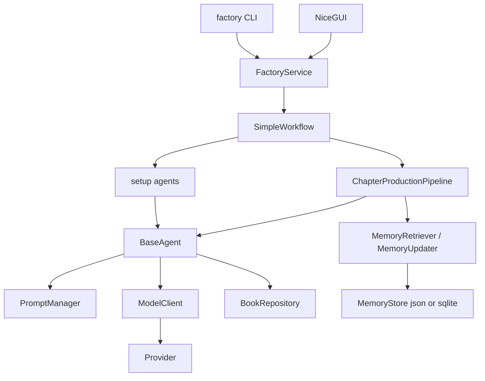

# Novel Factory

单机 Python 工具：用在线 LLM API 规划、写作、审稿、改稿长篇网文。

当前是可运行骨架。默认 `provider: mock`，不需要 API key，也不打真实模型。

`docs/` 是早期策略稿，不参与运行。

## 目录

1. [项目是什么](#1-项目是什么)
2. [设计理念](#2-设计理念)
3. [架构图](#3-架构图)
4. [项目目录](#4-项目目录)
5. [安装](#5-安装)
6. [环境变量](#6-环境变量)
7. [模型配置](#7-模型配置)
8. [创建小说](#8-创建小说)
9. [生成章节](#9-生成章节)
10. [GUI](#10-gui)
11. [Agent 工作流](#11-agent-工作流)
12. [Story Memory](#12-story-memory)
13. [数据保存位置](#13-数据保存位置)
14. [如何添加新 Agent](#14-如何添加新-agent)
15. [如何添加新模型 Provider](#15-如何添加新模型-provider)
16. [如何添加新 Prompt](#16-如何添加新-prompt)
17. [测试](#17-测试)
18. [Roadmap](#18-roadmap)

---

## 1. 项目是什么

Novel Factory 把一本长篇拆成固定步骤，每步一个 Agent：

- 开书：世界观 → 人物 → 故事骨架 → 总纲 → 分卷计划
- 单章：本章任务 → 正文 → 连续性检查 → 审稿 → 有限次改稿 → 写入 memory

输入是故事种子和 YAML 配置。输出是 `data/books/{book_id}/` 下的 JSON / Markdown 文件。

入口：

```bash
factory --help
python -m factory --help
```

不包含：RAG、向量库、Agent 互调、LangGraph、动画/视觉管线。可选 GUI 走同一套 Core（`FactoryService` → Workflow），删掉 GUI 后 CLI 仍可独立运行。

---

## 2. 设计理念

| 规则 | 含义 |
|------|------|
| Agent 互不调用 | 只有 `SimpleWorkflow` / `ChapterProductionPipeline` 排序。Agent 只读 `Runtime`。 |
| 业务代码不 import 厂商 SDK | Agent 只调 `ModelClient`。OpenAI / Anthropic / Gemini SDK 关在 `factory/models/providers.py`。 |
| Prompt 是 Markdown 文件 | `factory/prompts/*.md`。占位符 `{{var}}`，不用 Jinja2。 |
| 模型名不写进 Python | 写在 YAML 的 `models.*`。密钥只在 `.env`。 |
| 不把全书正文塞进模型 | `MemoryRetriever` 只拼 canon、相关人物、相关伏笔、本卷切片、本章任务、近章摘要、上章文末。 |
| 一步一件事 | Writer 只写正文。Reviewer 只评估。Revision 只改稿。Continuity 只查设定。Memory 只归档。 |

配置优先级（后者覆盖前者）：

```text
config/default.yaml  <  项目 YAML  <  环境变量  <  CLI
```

项目 YAML 任选其一：`--config path.yaml`、`FACTORY_CONFIG`、仓库根目录 `factory.yaml`、`config/local.yaml`。

---

## 3. 架构图

```text
CLI (typer) / GUI
  factory init | architect | continue | write | studio | ...
        │
        ▼
FactoryService                 # CLI 与 GUI 都走这里；不 import Agent / Provider / SQL
        │
        ▼
load_settings()          default.yaml < project < env < CLI
        │
        ▼
SimpleWorkflow(settings, book_id)
  BookRepository   PromptManager   ModelClient   StoryContext
  MemoryStore      MemoryRetriever MemoryUpdater UsageStore
        │
        ├── setup agents（AGENT_CLASSES）
        │     world_builder → character → novel_architect
        │     → outline → volume_planner
        │
        └── ChapterProductionPipeline
              load context → retrieve memory
              → chapter_planner → chapter_writer
              → continuity → reviewer → decision
                    ├─ pass → save
                    └─ fail → revision → re-review（≤ max_revision_rounds）
              → memory_update → persist
        │
        ▼
BaseAgent.ask_json / ask_text
  PromptManager.render(name.md)
  ModelClient.generate[_structured]
  Provider.complete          mock | openai | openrouter | anthropic | gemini | qwen
  ModelRegistry              providers / models / agents（配置查找，不调用 API）
        │
        ▼
落盘: BookRepository + SchemaStore + MemoryStore
用量: data/books/usage.sqlite（元数据，无正文、无 API key）
```



---

## 4. 项目目录

```text
.
├── config/
│   ├── default.yaml          # 出厂配置（mock）
│   └── qwen.example.yaml     # Qwen / 混用厂商示例，复制为 factory.yaml
├── data/books/               # 书库，与代码分离
│   ├── usage.sqlite          # 模型调用统计
│   └── {book_id}/            # 见第 13 节
├── docs/                     # 策略文档，不参与运行
├── factory/                  # Python 包
│   ├── cli.py
│   ├── service.py            # GUI/CLI 共用的 Application Service
│   ├── settings.py
│   ├── workflow.py
│   ├── context.py
│   ├── events.py             # generic WorkflowEvent（callback，无 GUI 文案）
│   ├── gui/                  # 可选 GUI（NiceGUI）；Core 不 import
│   │     dashboard / studio / bible / outline / memory / models / settings
│   │     presentation/  adapters.py（页面拼装，不在 Core）
│   ├── agents/               # BaseAgent 子类；互不 import
│   ├── models/               # ModelClient + specs + providers + usage
│   ├── prompts/              # Markdown 模板 + PromptManager
│   ├── pipeline/             # 单章流水线与 Pydantic 契约
│   ├── memory/               # 分层记忆
│   ├── schema/               # 人物 / 世界 / 情节线 Schema
│   └── storage/              # BookRepository
├── tests/
├── .env.example
└── pyproject.toml
```

---

## 5. 安装

需要 Python 3.11+。

```bash
cd factory          # 本仓库根目录（含 pyproject.toml）
python3 -m venv .venv
source .venv/bin/activate
pip install -e .
cp .env.example .env

# 离线冒烟：开书 + 写一章（mock，不打真实 API）
factory demo --out /tmp/factory-demo
```

离线 mock 到此即可。要接真实 API：

```bash
pip install -e ".[models]"
```

然后在 `.env` 填对应 key，并在 YAML 里改 `models.*.provider` / `models.*.model`。

GUI（可选，同一套 FactoryService）：

```bash
pip install -e ".[gui]"
factory studio
```

跑测试：

```bash
pip install -e ".[test]"
```

---

## 6. 环境变量

复制 `.env.example` 为 `.env`。不要把 key 写进 YAML、`novel.json`、或 Git。`.env` 已在 `.gitignore`。GUI 的 Models / API Settings 只检测这些名字是否存在，默认不显示、不写入密钥。

| 变量 | 作用 |
|------|------|
| `OPENAI_API_KEY` | OpenAI |
| `OPENROUTER_API_KEY` | OpenRouter |
| `ANTHROPIC_API_KEY` | Anthropic |
| `GEMINI_API_KEY` | Gemini（空则尝试 `GOOGLE_API_KEY`） |
| `DASHSCOPE_API_KEY` | 通义千问 / Qwen（DashScope；空则尝试 `QWEN_API_KEY`） |
| `FACTORY_PROVIDER` | 覆盖**所有** profile 的 provider。开发时保持 `mock`。混用厂商时请注释掉 |
| `FACTORY_BOOK` | 默认书 id |
| `FACTORY_DATA_DIR` | 书库目录，默认 `data/books` |
| `FACTORY_CONFIG` | 项目 YAML 路径 |
| `FACTORY_LANGUAGE` | `project.language` |
| `FACTORY_CHAPTER_TARGET_WORDS` | 目标字数 |
| `FACTORY_MAX_REVISION_ROUNDS` | 改稿轮次上限 |
| `FACTORY_STORAGE_BACKEND` | `json` 或 `sqlite`（memory 后端） |
| `FACTORY_RECENT_CHAPTERS` | 近章条数 |
| `FACTORY_MODEL_ARCHITECT` 等 | 覆盖对应槽位的 **model id**，不是写进 Python |

CLI 高于环境变量：

```bash
factory --provider mock continue
factory --config ./factory.yaml status
```

`--book` / `-b` 只覆盖当前命令的书，不改 YAML。

---

## 7. 模型配置

GUI 和 CLI **不要硬编码** Qwen / GPT / Claude / Gemini。可用厂商和模型从 YAML 读，经 `ModelRegistry` 查找。真正的 API 调用仍是 `ModelClient` → `Provider`。

```text
providers: + models: + default_model + agents:
        ↓
  ModelRegistry.list_models() / assigned_model_name()
        ↓
  Agent.profile_name() → ModelClient.generate[_structured] → Provider.complete
```

两级映射：

1. `default_model` — 全局默认 catalog key（例如 `qwen_writer`）
2. `agents.<name>.model` — 单个 Agent 覆盖；省略则继承 Default

GUI 下拉显示 `display_name`（Qwen Plus / Claude Sonnet / GPT 4o mini），保存的是 profile ID。不要写 `if selected == "Qwen"`.

普通 UI 只展示 Agent、Provider、Model。`base_url`、`api_key_env` 名、timeout 在 Models → Advanced。密钥值不出现在页面上。

查看当前配置（不打 API）：

```bash
factory models
```

### Catalog 与 Agent 映射

`models:` 是具名目录（可以有很多预设，不只四个槽位）。`agents:` 指定每个 Agent 用哪一条。`providers:` 控制 GUI/CLI 是否展示该厂商。

```yaml
default_model: qwen_writer

providers:
  qwen:
    enabled: true
  anthropic:
    enabled: true
  openai:
    enabled: true
  mock:
    enabled: false

models:
  qwen_writer:
    provider: qwen
    model: qwen-plus
    display_name: Qwen Plus
    roles: [writer]
    temperature: 0.8
  claude_architect:
    provider: anthropic
    model: claude-sonnet-4
    display_name: Claude Sonnet
    roles: [architect]
    temperature: 0.45
  gpt_reviewer:
    provider: openai
    model: gpt-4o-mini
    display_name: GPT 4o mini
    roles: [reviewer]
    temperature: 0.2

agents:
  world_builder:
    model: claude_architect
  reviewer:
    model: gpt_reviewer
```

Writer / Revision 未出现在 `agents:` 里时继承 `default_model`。

`roles` 标记一条 catalog 适合哪些 Agent。GUI 用它过滤下拉框；缺省时该条目对所有 Agent 可见。

GUI 选择写入 `config/local.yaml`（或 `FACTORY_CONFIG`），只存 profile ID：

```yaml
default_model: qwen_writer
agents:
  world_builder:
    model: claude_architect
  reviewer:
    model: gpt_reviewer
```

四个角色槽位仍然可用（也是 Agent 类上的默认 `model`）：

| 槽位 | Agent |
|------|--------|
| `architect` | `world_builder`, `character`, `novel_architect`（缺省回退 `planner`） |
| `planner` | `outline`, `volume_planner`, `chapter_planner` |
| `writer` | `chapter_writer`, `revision` |
| `reviewer` | `continuity`, `reviewer`, `memory` |

出厂 `config/default.yaml` 全是 mock。接真实模型时复制 `config/qwen.example.yaml` 为 `factory.yaml`，或自己写 overlay（不要改 Python）。

完整混用示例见 `config/qwen.example.yaml`。最小写法也可以只改四个槽位：

```yaml
models:
  architect:
    provider: anthropic
    model: claude-sonnet-4
    temperature: 0.45
  planner:
    provider: qwen
    model: qwen-plus
    temperature: 0.3
  writer:
    provider: qwen
    model: qwen-plus
    temperature: 0.8
  reviewer:
    provider: openai
    model: gpt-4o-mini
    temperature: 0.2
```

已实现的 provider 名：`mock`、`openai`、`openai_compat`、`openrouter`、`anthropic`、`gemini`、`qwen`。

`api_key_env` 可省略，按 provider 使用上表默认环境变量名。

Python 侧（GUI 用这个，不要写死厂商名）：

```python
from factory.models.registry import ModelRegistry
from factory.settings import load_settings

registry = ModelRegistry.from_settings(load_settings())
registry.list_providers()
registry.list_models()
registry.assigned_model_name("chapter_writer")
registry.get_model("qwen_writer")
registry.get_provider("qwen")
```

### 通义千问 / Qwen

`provider: qwen` 与 OpenAI / Anthropic / Gemini / OpenRouter 同级。Workflow 与 Agent 不识别模型名。

底层走阿里云 DashScope 的 **OpenAI 兼容** Chat Completions（`https://dashscope.aliyuncs.com/compatible-mode/v1`），复用 `openai` SDK，不引入 dashscope 专用包。retry / JSON 修复 / usage 仍在 `ModelClient`。

1. `pip install -e ".[models]"`
2. `.env` 填写 `DASHSCOPE_API_KEY`（或备用 `QWEN_API_KEY`）
3. 把 `config/qwen.example.yaml` 复制为仓库根目录 `factory.yaml`，或 `factory --config config/qwen.example.yaml …`
4. **混用多个厂商时注释掉 `.env` 里的 `FACTORY_PROVIDER`**，否则会把所有槽位 stamp 成同一个 provider

只把写作槽位切到 Qwen：

```yaml
models:
  writer:
    provider: qwen
    model: qwen-plus
    temperature: 0.8
```

国际站把 `base_url` 改成 `https://dashscope-intl.aliyuncs.com/compatible-mode/v1`。

切换模型 id 不要改 Python：改 YAML 的 `models.*.model`，或设 `FACTORY_MODEL_WRITER=qwen-max` 等环境变量。临时把全书切到 Qwen：

```bash
factory --provider qwen continue
```

Writer / Revision 的正文走 `Provider.stream()`（OpenAI 兼容含 Qwen、Anthropic、Gemini、mock 分块）。JSON Agent 仍用 `complete()`。

---

## 8. 创建小说

```bash
factory init my_novel \
  --title "残灵古剑" \
  --genre 修仙爽文 \
  --style "克制、短句、先抑后扬" \
  --seed "灵根残缺少年在宗门试炼中被逼入绝境，借旧伤中残留的古剑灵息反击。"
```

这会创建 `data/books/my_novel/`，并把该书写成 `.current`。

然后跑开书四步（世界、人物、骨架、总纲）：

```bash
factory architect --book my_novel
```

分卷：

```bash
factory plan-volume 1 --book my_novel
```

查看进度：

```bash
factory status
factory character list
factory plot list
```

书的解析顺序：`--book` → `FACTORY_BOOK` → `data/books/.current` → `project.book`。

---

## 9. 生成章节

CLI 与 Chapter Studio 都调用 `FactoryService` 的同名操作：`plan` / `generate` / `review` / `revise`。Studio 按按钮拆开跑；`factory continue` 调用 `produce_chapter()`，内部仍是同一条流水线（plan → write → continuity → review → revise → save → memory）。

一条命令走完整章流水线（缺分卷计划会先 `plan-volume`）：

```bash
factory continue
```

它找下一章还没有 `final.md` 的大纲章节。失败中断后，若 `pipeline.json` 状态是 `failed` / `running`，再次 `continue` 会从断点恢复。

拆开跑：

```bash
factory plan-chapter 1
factory write 1
factory review 1          # continuity + reviewer，不改稿
factory revise 1          # 只按最近审稿改一稿
```

其它：

```bash
factory memory show
factory models            # 配置里的 providers / 具名模型 / agent 映射
factory stats             # 今日调用次数 / tokens / 估费 / 按 agent、model
factory stats --book my_novel
factory demo --out /tmp/factory-demo   # 离线 mock 冒烟
```

`factory stats` 读 `data/books/usage.sqlite`，不要求书已存在。

---

## 10. GUI

Novel Factory 的操作界面。CLI 与 GUI 都只调用 `FactoryService`，再进入 Workflow → Agents → ModelClient。不直连厂商 SDK，也不读 SQL。没有第二套 Agent / Memory / Model / Workflow。

```bash
pip install -e ".[gui]"
factory studio --book demo
# 或 factory-gui --book demo
```

默认打开当前书（`.current` / `FACTORY_BOOK` / `project.book`）。顶栏 7 页：

| 页面 | 路径 | 数据 | 动作 |
|------|------|------|------|
| Dashboard | `/` | meta、字数、开放线索、最近调用 | 继续下一章 → `Service.continue_next` |
| Chapter Studio | `/studio` | 章节正文 + Inspector | Plan / Generate / Review / Revise / Accept |
| Story Bible | `/bible` | `knowledge/*`（SchemaStore） | 列表+详情，可手工保存 |
| Outline | `/outline` | outline / volume plan / chapter plan | 树 + 预览 |
| Memory | `/memory` | `memory/*` 分层 | 只读 |
| Models | `/models` | ModelRegistry + API 状态 | 切换 Default / 角色槽位；Test Connection |
| Settings | `/settings` | `generation.*` / `memory.*` / 存储后端 | 写入 `config/local.yaml`，不写 API Key |

### Chapter Studio

三栏：

| 区域 | 内容 |
|------|------|
| 左 Novel Navigator | Novel → Volume → Chapter，选择、新建、状态 |
| 中 Chapter Editor | 标题、大面积正文、字数、版本；Save / 继续生成 |
| 右 AI Inspector | Plan / Context / Review / Continuity / Memory |

顶栏：Writer Model 下拉来自 `ModelRegistry.list_models()`（GUI 按 `roles` 过滤），值为 catalog profile ID（例如 `qwen_writer`），不是厂商名。

Target 覆盖本章 `chapter_target_words`（仅本次运行）。

执行时状态行与步骤清单由 GUI 自己映射 Core 事件：`workflow_started` / `stage_started` / `token` / `stage_completed` / `error` / `workflow_completed`。例如 `stage="chapter_writer"` → 状态行 “Writing”，步进器圆点（`✓` / `●` / `○`）在 `gui/presentation/progress.py`。这是进程内 callback，没有 Kafka / Redis / Celery。

Writer / Revision 走 `Provider.stream()` → `ModelClient` → `WorkflowEvent(type="token")` → 编辑器追加正文。Provider 若无流式实现，则一次回全文。

### Models / API Settings

- API：Qwen / OpenAI / Anthropic / Gemini / OpenRouter 显示 Configured 或 Missing（只看环境变量是否非空）。Mock 不需要 key。
- **Test Connection** 经 `FactoryService.test_connection()` → `ModelClient` → Provider，GUI 不直连 SDK。缺 key 时提示环境变量**名**，不回显密钥。
- Assignments：Global Default + Architect / Planner / Writer / Reviewer 覆盖。
- 第一阶段不在 GUI 里写入 API Key。以后若支持，必须走安全配置（系统钥匙串等），仍然禁止写入 YAML / JSON / Git / 普通日志。

删掉 `factory/gui/` 不影响 CLI。

---

## 11. Agent 工作流

### Setup（`factory architect` + `plan-volume`）

```text
world_builder → character → novel_architect → outline → volume_planner
```

Workflow 按名字从 `AGENT_CLASSES` 取出类，依次 `run(state)`。Agent 之间没有函数调用。

### Chapter（`factory continue`）

```text
load_story_context
→ retrieve_relevant_memory
→ chapter_planner
→ chapter_writer
→ continuity_check
→ quality_review
→ decision
     ├─ pass → save
     └─ fail → revision → 再 continuity + review
               （次数 ≤ generation.max_revision_rounds，默认 2）
→ memory_update
→ persist
```

中间结果在 `chapters/chXXX/pipeline.json`。契约类型在 `factory/pipeline/models.py`：`ChapterPlan`、`ChapterDraft`、`ContinuityReport`、`ReviewResult`、`RevisionRequest`、`ChapterRecord`。

每步怎么调模型：

```text
BaseAgent.ask_json / ask_text
  → PromptManager.render(prompt_name)
  → ModelClient.generate[_structured](profile=self.model)
  → Provider.complete
```

---

## 12. Story Memory

写章节时不会加载历史正文全文。

检索包（`MemoryRetriever.for_writer`）：

- Level 1 Canon：世界摘要、规则、主角、永久事实
- Level 2 Entities：本章相关人物当前状态（有人数上限）
- Level 3 Plot：相关未收束伏笔、当前冲突
- Level 4 近章：最近 N 章摘要 + 上章文末 `prev_tail_chars` 字

章后：`MemoryAgent` 抽出结构化记录 → `MemoryUpdater.merge` → `MemoryStore` 落盘。

存储：

- 默认 JSON：`memory/canon.json`、`entities.json`、`plot.json`、`chapters.jsonl`
- `storage.backend: sqlite` 时同一套接口换 SQLite 文件

`factory memory show` 打印冲突、事实、开放线程、近章摘要。

---

## 13. 数据保存位置

根目录：`storage.data_dir`（默认 `data/books`）。

```text
data/books/
  .current
  usage.sqlite
  {book_id}/
    meta.json
    architecture.json
    outline.json
    volumes/v001/plan.json
    knowledge/
      world.json
      characters.json
      plot.json
      timeline.json
    chapters/ch001/
      plan.json
      draft.md
      continuity.json
      review.json
      final.md
      pipeline.json
      record.json
    memory/
      canon.json
      entities.json
      plot.json
      chapters.jsonl
      summaries.jsonl
```

书的正文、大纲、设定都在这里。代码仓库不提交章节产物（见 `.gitignore`）。

---

## 14. 如何添加新 Agent

1. 在 `factory/agents/` 新增类，继承 `BaseAgent`。
2. 设置 `name`、`model`（四个槽位之一）、`prompt_name`、`required_outputs`；JSON 步再设 `output_schema`。
3. 实现 `execute(self, state) -> dict`。只通过 `self.ask_json` / `self.ask_text` 调模型，不要 import 其它 Agent，不要 import 厂商 SDK。
4. 在 `factory/agents/__init__.py` 的 `AGENT_CLASSES` 注册。若属于单章流水线，同时加入 `CHAPTER_AGENTS`。
5. 需要进默认顺序时，改 `config/default.yaml` 的 `workflow` / `workflows.*`。
6. 补对应 `factory/prompts/{prompt_name}.md`（见第 16 节）。
7. 加一个离线测试：用 `MockModelProvider`，不要打真实 API。

最小骨架：

```python
class MyAgent(BaseAgent):
    name = "my_agent"
    model = "planner"
    prompt_name = "my_agent"
    required_outputs = ("result",)
    output_schema = {"type": "object"}

    def execute(self, state: dict) -> dict:
        payload = self.ask_json(purpose="my_agent")
        return {"result": payload}
```

---

## 15. 如何添加新模型 Provider

厂商元数据集中在 `factory/models/specs.py`。SDK 只能出现在 `factory/models/providers.py`。

**OpenAI-compatible 厂商（DeepSeek / Kimi / GLM）** — 通常只改一处：

1. 在 `PROVIDERS` 里加一条 `ProviderSpec`：`id`、`display_name`、`env_keys`、`base_url`、`ping_model`，`backend="openai_compat"`。
2. YAML 里把某个槽位的 `provider` 改成新 `id`。需要隐藏时在 `providers:` 里设 `enabled: false`。

**独立 SDK 厂商** — 再加 class：

1. 继承 `Provider`，实现 `complete(...)`。超时、429、5xx 抛 `RetryableError`，其它抛 `ProviderError`。不要在 Provider 里重试。
2. 在 `ProviderSpec.backend` 写一个新 kind，并在 `build_provider()` 增加对应分支。
3. 从环境变量读 key，不要把 key 写入 `GenerationResult` 或 usage 日志。

测试用 `MockProvider` 或假 key；单元测试禁止真实 HTTP。`complete` 必须填 `text`、`model`、`provider`，尽量填 `usage` 与 `latency_ms`。

不要把 UI icon / CSS / 下拉颜色放进 `ProviderSpec`。GUI 可自行映射 `display_name`。

---

## 16. 如何添加新 Prompt

1. 在 `factory/prompts/` 新增 `{name}.md`，文件名等于 Agent 的 `prompt_name`。
2. 使用这六个一级标题（缺一不可，测试会查）：

```markdown
# Role
（这段进入 system）

# Objective
...

# Input
- 书名：{{story_title}}
- ...

# Requirements
...

# Constraints
...

# Output Format
只输出 JSON / 或只输出正文。
```

3. 占位符是 `{{variable}}`。未替换的 `{{x}}` 会原样留下。JSON 花括号不会被 `str.format` 吃掉。
4. `# Role` 变成 system，其余标题按顺序拼进 user。
5. 常用变量来自 `StoryContext.prompt_vars()`：`story_title`、`genre`、`style`、`world_context`、`character_context`、`chapter_plan`、`recent_context`、`language`、`chapter_target_words` 等。Agent 可用 `extra_vars` 再补。

`PromptManager` 只做读文件 + 替换，没有模板逻辑。

---

## 17. 测试

全部离线。不要在普通单测里打真实模型。

```bash
pip install -e ".[test]"
pytest
pytest tests/test_demo.py -v    # 只跑离线 demo
```

安装后也可以直接跑：

```bash
factory demo --out /tmp/factory-demo
```

它会强制 `provider=mock`，新建一本 `demo` 书，跑完 setup + 第 1 章，并检查 `outline.json`、`chapters/ch001/final.md`、memory 等产物。逻辑在 `factory/demo.py`，测试在 `tests/test_demo.py`。

核心用例在 `tests/test_core.py`：PromptManager、配置加载、`MockModelProvider`、JSON 解析、memory merge、章节 workflow、改稿上限、storage、Pydantic schema。

可编程 mock：

```python
from factory.models.providers import MockModelProvider
from helpers import install_mock

mock = MockModelProvider(
    by_prompt={"本章任务": {"title": "固定章", "scenes": []}},
    by_purpose={"review": {"score": 10, "must_fix": ["重写"], "passed": False}},
)
install_mock(workflow.models, mock)
```

未命中的 purpose 仍走 `factory/models/mock_data.py` 里的固定 JSON，所以 `factory continue` 在 mock 下可以跑完整章。

---

## 18. Roadmap

已有：mock 全流程、Typer CLI、YAML 配置、分层 memory、JSON/SQLite 存储、用量统计、pytest 离线测试、Qwen Provider + Model Registry、GUI（Dashboard / Studio / Bible / Outline / Memory / Models / Settings）、WorkflowEvent + Writer streaming。

近期（仍限制在单机写作管线）：

- 用真实 provider 做一次人工冒烟（不放进默认 CI）
- 补 `pricing` 表，让 `factory stats` 的估费有意义
- 失败章节的 CLI 提示（指出 `pipeline.json` 断点）
- 按书覆盖 `factory.yaml` 的文档与示例

明确不做（除非产品范围改口）：

- RAG / 向量库
- Agent 互调或多智能体自治
- LangGraph 一类编排框架
- 动画、立绘、TTS 管线（见 `docs/`，与本仓库运行时无关）
